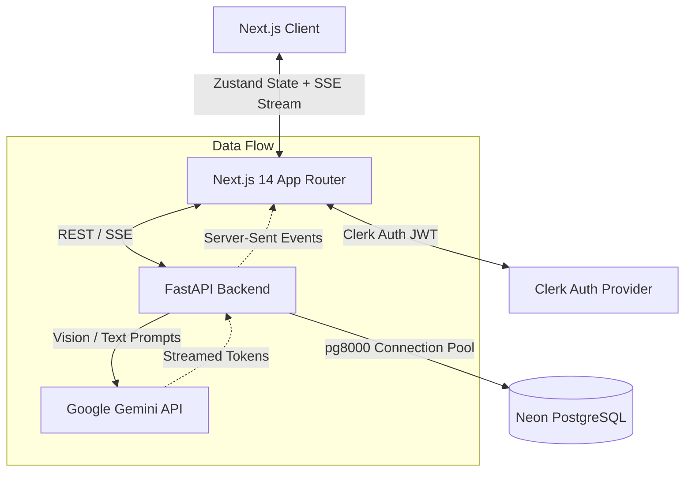

<div align="center">
  

  # Document Summary Assistant
  
  **A production-grade, real-time AI document processing platform.**
  
  [](https://nextjs.org/)
  [](https://fastapi.tiangolo.com/)
  [](https://ai.google.dev/)
  [](https://neon.tech/)
  [](https://clerk.com/)
  
  [**View Live Application**](https://document-summary-assistant-lovat.vercel.app/) • [**View System Architecture**](#-system-architecture)

</div>

---

## 🚀 Overview

While document summarization is a standard AI use case, **productionizing it for scale is not**. 

This application was engineered to treat a simple prompt as a rigorous system design exercise. Instead of building a basic wrapper around an LLM, this platform implements **real-time token streaming (SSE)**, **optimistic state caching**, **graceful authentication degradation**, and **zero-downtime CI/CD validation**.

### 🎯 The "Wow Factor" (Why This Stands Out)

- **Real-Time Streaming (SSE)**: Eliminates perceived latency. Summaries stream word-by-word onto the screen exactly like ChatGPT, rather than forcing the user to stare at a 10-second loading spinner.
- **Interactive Document Q&A**: Users aren't limited to static summaries. A persistent contextual chat interface allows users to interrogate the document.
- **Graceful Authentication Degradation**: 
  - *Anonymous users* experience zero friction—they can upload, summarize, and chat instantly (state is strictly ephemeral).
  - *Logged-in users* (via Clerk) gain access to a persistent PostgreSQL-backed Dashboard where their document history and insights are safely stored across sessions.
- **O(1) State Caching**: Built with Zustand, switching between Summary Depths (Concise, Medium, Detailed) instantly loads cached results without triggering redundant AI API calls, saving token costs and API rate limits.
- **Bento-Box UI**: Designed with a premium, responsive "Neo-Brutalist" aesthetic featuring micro-interactions and strict accessibility scaling.

---

## 🏗️ System Architecture

The application is decoupled into two highly scalable services to separate the heavy compute (AI/Extraction) from the UI layer.



### Technical Stack Decisions

1. **Next.js 14 (Frontend)**: Chosen for its App Router, robust middleware routing, and seamless edge-caching capabilities.
2. **FastAPI (Backend)**: Python was chosen specifically for its superior ecosystem in handling data ingestion and AI streaming capabilities via `StreamingResponse`. 
3. **Gemini 3.5 Flash Lite**: Selected over local Tesseract OCR. Local OCR is notoriously fragile with handwriting and complex layouts. Gemini Vision API acts as a highly robust, unified extraction and reasoning engine.
4. **Neon PostgreSQL**: A serverless database that scales to zero, perfectly matching the stateless nature of the Vercel/Render hosting environments.

---

## 💻 Local Setup & Development

### Prerequisites
* Node.js (v20+)
* Python (3.10+)
* Google Gemini API Key

### 1. Backend Setup
```bash
cd backend
python -m venv venv
source venv/bin/activate  # Windows: venv\Scripts\activate
pip install -r requirements.txt
```
Create a `.env` file in the `backend/` directory:
```env
GEMINI_API_KEY=your_gemini_key_here
NEON_DATABASE_URL=sqlite:///./test.db # Use SQLite for quick local testing
```
Start the API:
```bash
python -m uvicorn main:app --reload
```

### 2. Frontend Setup
```bash
cd frontend
npm install --legacy-peer-deps
```
Create a `.env.local` file in the `frontend/` directory:
```env
NEXT_PUBLIC_CLERK_PUBLISHABLE_KEY=your_clerk_publishable_key
CLERK_SECRET_KEY=your_clerk_secret_key
NEXT_PUBLIC_API_URL=http://localhost:8000
```
Start the UI:
```bash
npm run dev
```

---

## 🧪 Testing & CI/CD

This repository enforces strict deployment gates. The GitHub Actions pipeline (`.github/workflows/ci.yml`) automatically executes on every push to `main`:
1. Pre-compiles and lints the Next.js frontend to prevent hydration/build errors.
2. Boots a test environment and executes the `pytest` suite against the FastAPI backend.
3. Only upon full success are deployments pushed to Vercel/Render.

To run tests locally:
```bash
cd backend
pytest test_main.py
```

---
<div align="center">
<i>Built to demonstrate engineering maturity, emphasizing architecture, resilience, and UX.</i>
</div>
